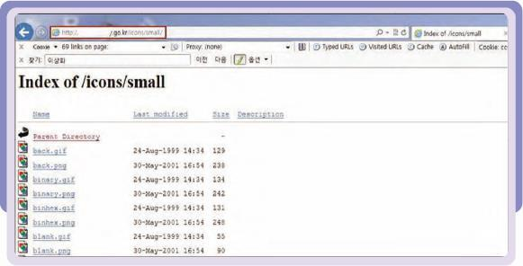
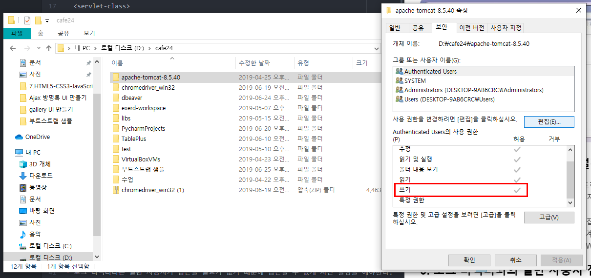
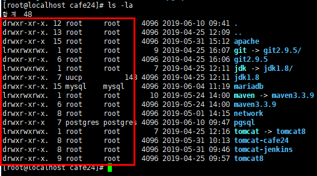
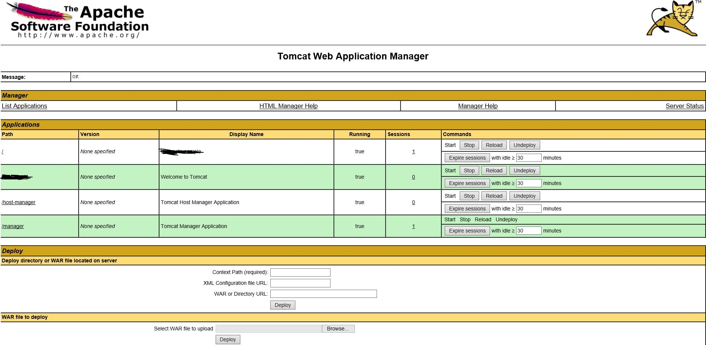
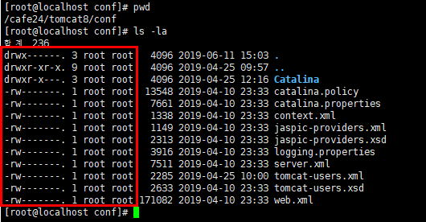


# chapter 9. 톰캣 보안 설정

### 들어가기 전에

- 톰캣은 아파치와 연동하여 html 파일은 아파치가 수행하고 jsp 파일은 톰캣이 수행하도록 한다.
- 톰캣은 java 언어만 해석이 가능하다. 그러나 아파치는 php언어가 가능해서 둘은 서로 상호보완적이다.

### 1. 디렉터리 인덱싱 차단 설정

- 디렉터리 인덱싱: 공격자에게 웹 시스템 구조를 파악할 수 있도록 해준다. -> 디렉토리 파일 목록을 알려줌 -> 자료 유출 발생 가능성 up

- 디렉터리 인덱싱 차단 설정(false로 설정한다.)
```java
<servlet>
  <servlet-name>default</servlet-name>
  <servlet-class>
    org.apach.catalina.servlets.DefaultServlet
  <servlet-class>
  <init-param>
    <param-name>listings</param-name>
    <param-value>false</param-value>
  </init-param>
  <load-on-startup>1</load-on-startup>
</servlet>
```




### 2. 홈 디렉터리 쓰기 권한 차단 설정

- 톰캣 홈 디렉터리에 일반 사용자 권한이 과도하게 설정되어 있으면 실행 파일의 내용이 변조(서비스 실행 및 종료)될 수 있으므로 관리자 계정을 제외한 모든 계정은 권한을 최소화하여야 한다.

- 톰캣 폴더 오른쪽 클릭 -> 속성 -> 보안 -> 편집 -> 쓰기 권한 체크 해제



- 웹 서버 홈 디렉터리의 소유권은 전용 WAS 계정으로 설정하고, 권한을 744 이하로 설정한다. 관리 서버 홈 디렉터리의 소유권은 전용 WAS 계정이고, 권한은 740이하로 설정한다.



### 3. 로그 디렉터리의 일반 사용자 접근 차단 설정

- 로그 디렉터리는 일반 사용자가 접근할 필요가 없기 때문에 접근할 수 없게 차단 설정을 해야한다.

- 설정방법: 해당 로그 폴더 들어가서 권한 차단

- 로그 디렉터리의 소유권은 전용 WAS 계정으로 설정하고, 권한을 740 이하로 설정한다. 로그 파일의 소유권은 전용 WAS 계정이고, 권한은 640이하로 설정한다.

### 4. 사용자 오류 페이지 설정(커스텀 오류 페이지)

- web.xml 파일에 <error-page>를 설정해준다.

```xml
<error-page>
  <error-code>401</error-code>
  <location>/error.jsp</location>
</error-page>
<error-page>
  <error-code>402</error-code>
  <location>/error.jsp</location>
</error-page>
<error-page>
  <error-code>403</error-code>
  <location>/error.jsp</location>
</error-page>
<error-page>
  <error-code>404</error-code>
  <location>/error.jsp</location>
</error-page>
<error-page>
  <error-code>500</error-code>
  <location>/error.jsp</location>
</error-page>
```

### 5. 메소드 제한 설정

- 필요없는 메소드는 모두 비활성화시키는 편이 바람직하다. HTTP Method(PUT, DELETE, TRACE)가 필요 이상으로 활성화되어 있으면 악의적인 공격자에 의해 임의의 파일을 삭제하거나 업로드 하여 피해를 줄 수 있으므로 HTTP Method 제한으로 피해를 최소화하여야 한다.
- 윈도우의 명령 창에서 다음과 같이 입력하면 허용돼 있는 메소드들이 표시된다.

> telnet 도메인명 80(엔터)
> OPTIONS / HTTP/1.0 또는 OPTIONS * HTTP/1.0 (엔터 2번)

- 톰캣의 불필요한 메소드를 제거하려면 [톰캣 설치 디렉터리]/conf/web.xml 파일에서 제거할 메소드를 추가해 설정한다.

```xml
<security-constraint>
  <display-name>Forbidden</display-name>
  <web-resource-collection>
    <web-resource-name>Protected Area</web-resource-name>
    <url-pattern>/*</url-pattern>
    <http-method>DELETE</http-method>
    <http-method>TRACE</http-method>
    <http-method>HEAD</http-method>
    <http-method>PUT</http-method>
    <http-method>COPY</http-method>
    <http-method>MOVE</http-method>
    <http-method>LOCK</http-method>
  </web-resource-collection>
  ...  
</security-constraint>
```

### 6. 디폴트 페이지 삭제

- 디폴트 페이지 및 기타 샘플 페이지나 불필요한 파일들이 존재할 경우 모두 삭제해야 한다.

- 웹 서버를 생성하게 되면 기본적으로 생성되는 메뉴얼 파일은 외부 침입자에게 정보를 줄 수 있다.

### 7. 관리자 콘솔 접근 제한 설정

- 디폴트 포트인 8080 포트나 80포트로 비인가자가 관리자 페이지를 열람할 수 있을 경우 취약하며, 톰캣의 관리자 콘솔 사용 유무를 확인해야 한다.

- 디폴트 포트인 8080 포트는 공격자가 유추할 수 있으므로, 유추할 수 없는 포트로 변경한다. 지정되지 않은 포트인 1024~65534 사이의 임의의 포트를 사용한다.

- server.xml파일에서 디폴트 관리자 포트를 변경한다.

```xml
<Connector port="8880"
    ....
/>
```

- 특정 페이지에 대한 접근 제어 설정은 다음과 같다.

```xml
<Context path="/manager">
  <Value className="org.apache.catalina.values.RemoteAddrValue" allow="127.0.0.1" / >
  <Value className="org.apache.catalina.values.RemoteAddrValue" deny="192.168.30.*" / >
</Context>
```



### 8. 관리자 콘솔의 디폴트 계정/패스워드 변경

- 관리자 콘솔의 아이디/패스워드를 디폴드로 사용할 경우 공격자가 쉽게 접근할 수 있기 때문에 반드시 변경한 후 사용해야 한다.

- [톰캣 디렉터리]/conf/tomcat-users.xml 환경설정 파일을 수정하여 디폴트 계정/패스워드를 변경한다.

### 9. 관리자 콘솔용 패스워드 파일의 접근 제한 설정

- 소유권은 전용 WAS 계정으로 설정하고, [톰캣 디렉터리]/conf/tomcat-users.xml 권한을 700 또는 600으로 설정한다.



### 10. 소스 파일이나 설정 파일 접근 권한 설정

- [톰캣 디렉터리]/conf/server.xml 파일의 appBase를 통해 소스 파일을 확인해 파일의 쓰기 권한 설정 여부를 호가인하고, [톰캣 설치 디렉터리]/conf/ 디렉터리의 모든 xml 파일과 properties 파일, policy 파일의 권한을 확인한다.

- 소스 파일의 소유권은 전용 WAS 계정으로 설정하고, 740이하 권한으로 설정한다. 설정 파일은 600 또는 700 권한으로 설정한다.

### 참고자료

- https://m.blog.naver.com/PostView.nhn?blogId=crehacktive3&logNo=221168324657&proxyReferer=https%3A%2F%2Fwww.google.com%2F
